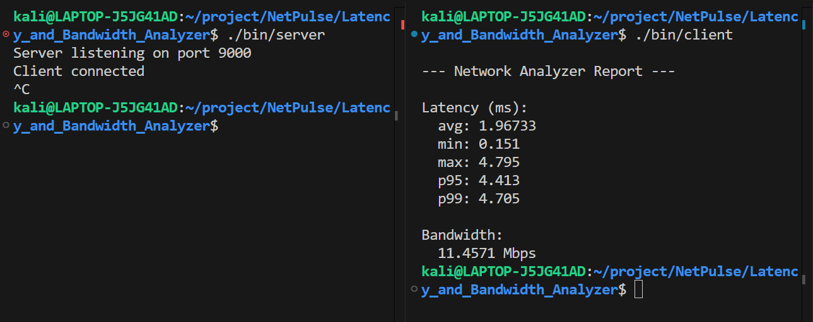
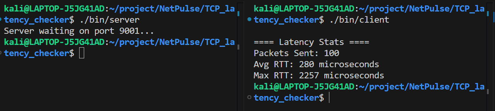

# NetPulse

Lightweight Network Bandwidth &amp; Latency Analyzer

## 📌 Projects Included

### 1. Latency & Bandwidth Analyzer

Analyzes latency distribution (avg, min, max, p95, p99) and bandwidth.

### 2. TCP Latency Checker

Measures round-trip time (RTT) at microsecond precision.

---

## 🧠 Key Focus Areas

- Low-level networking (POSIX sockets)
- Latency measurement & analysis
- Tail latency (p95/p99)
- System-level performance behavior

---

## 📁 Folder Structure

```
└── 📁NetPulse
    └── 📁Latency_and_Bandwidth_Analyzer
        └── 📁bin
            ├── client
            ├── server
        └── 📁client
            ├── client.cpp
        └── 📁server
            ├── server.cpp
        └── 📁utils
            ├── protocol.h
            ├── timer.h
    └── 📁TCP_latency_checker
        └── 📁bin
            ├── client
            ├── server
        └── 📁client
            ├── client.cpp
        └── 📁server
            ├── server.cpp
    ├── .gitignore
    ├── Notes.txt
    └── README.md
```

# 1. Network Latency & Bandwidth Analyzer

A C++-based network performance analysis tool that measures **latency** and **bandwidth** using POSIX sockets.

---

## 🚀 Overview

This project extends basic latency measurement by analyzing:

- Average latency
- Minimum & maximum latency
- Tail latency (**p95, p99**)
- Bandwidth (Mbps)

It provides a more realistic view of network performance by focusing on **latency distribution**, not just averages.

---

## ⚙️ Tech Stack

- C++
- POSIX Socket APIs
- TCP/IP Networking
- High-resolution timers

---

## 🧠 Key Concepts

- Latency distribution (avg, min, max)
- Tail latency (p95, p99)
- Bandwidth estimation
- Performance variability (jitter)
- Throughput vs latency trade-offs

---

## 🛠️ Build & Run

### 1. Compile

```bash
mkdir -p bin
g++ client/client.cpp -Iutils -o bin/client
g++ server/server.cpp -Iutils -o bin/server
```

### 2. Run

**Terminal 1 (Server):**

```bash
./bin/server
```

**Terminal 2 (Client):**

```bash
./bin/client
```

---

## 📊 Sample Output

```
--- Network Analyzer Report ---

Latency (ms):
  avg: 3.12702
  min: 0.235
  max: 5.604
  p95: 5.537
  p99: 5.597

Bandwidth:
  8.36027 Mbps
```

## 📸 Sample Output



## 🔍 Observations

- Average latency does not reflect real performance
- **Tail latency (p95/p99)** is significantly higher than average
- Latency spikes indicate:
  - OS scheduling delays
  - Buffering and TCP overhead

- Bandwidth depends on data transfer efficiency and system limits

---

## 🎯 Learning Outcome

- Importance of **latency distribution in real systems**
- Understanding of **tail latency (critical in HFT systems)**
- Practical experience in **network performance measurement**
- Insight into **TCP behavior and overhead**

---

## 🚀 Future Improvements

- UDP-based analyzer for comparison
- Non-blocking I/O for higher performance
- Parallel/multi-client testing
- Visualization dashboard (graphs)

---

# 2. TCP Latency Checker

A lightweight C++ client-server application built using POSIX sockets to measure **round-trip time (RTT)** at microsecond precision.

---

## 🚀 Overview

This project measures network latency by sending small messages between a client and server over TCP and calculating the time taken for each round trip.

It is designed to demonstrate **low-level networking**, **latency measurement**, and **system-level variability**.

---

## ⚙️ Tech Stack

- C++
- POSIX Socket APIs (`socket`, `connect`, `send`, `recv`)
- TCP/IP Networking
- High-resolution timing (`std::chrono`)

---

## 🧠 Key Concepts

- Round Trip Time (RTT)
- Latency measurement in microseconds
- TCP communication overhead
- OS scheduling impact on latency (jitter)

---

## 🛠️ Build & Run

### 1. Compile

```bash
mkdir -p bin
g++ client/client.cpp -o bin/client
g++ server/server.cpp -o bin/server
```

### 2. Run (in two terminals)

**Terminal 1 (Server):**

```bash
./bin/server
```

**Terminal 2 (Client):**

```bash
./bin/client
```

---

## 📊 Sample Output

```
==== Latency Stats ====
Packets Sent: 100
Avg RTT: 468 microseconds
Max RTT: 2945 microseconds
```

## 📸 Sample Output



---

## 🔍 Observations

- Latency is **very low on localhost** due to absence of physical network
- However, latency is **not constant** and shows **jitter**
- Variability is caused by:
  - OS scheduling
  - Context switching
  - Background processes

---

## 🎯 Learning Outcome

- Hands-on experience with **POSIX socket programming**
- Understanding of **latency behavior and variability**
- Insight into **system-level effects on performance**

---

## 🚀 Future Improvements

- Add UDP comparison (TCP vs UDP latency)
- Introduce non-blocking sockets (`select()` / `poll()`)
- Multi-client support
- Real network testing (different machines)

---
